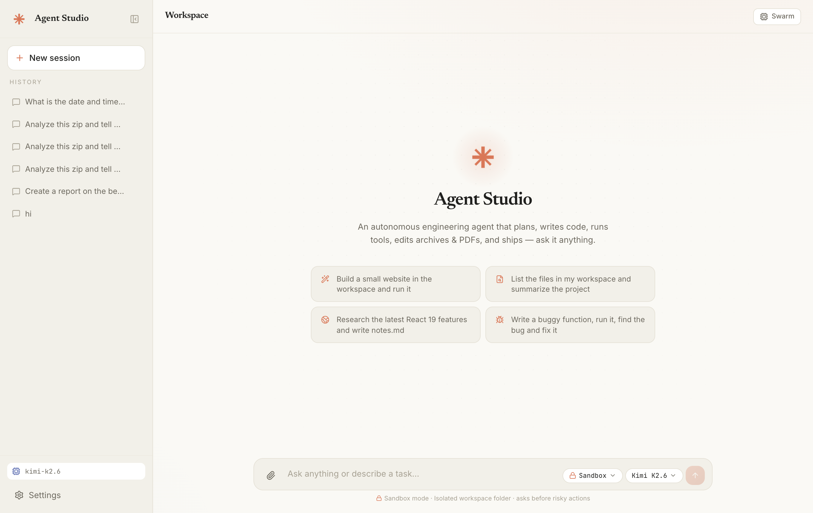
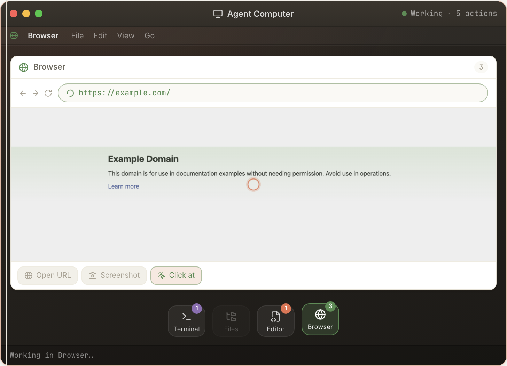
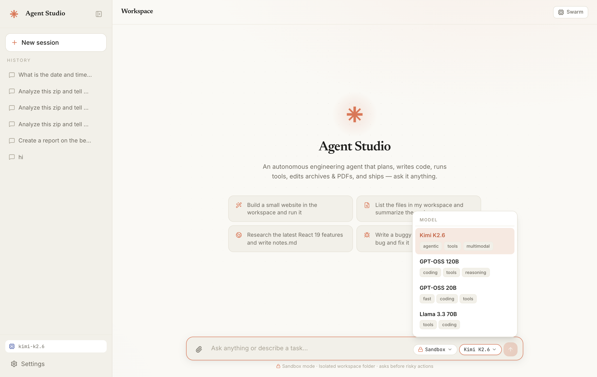
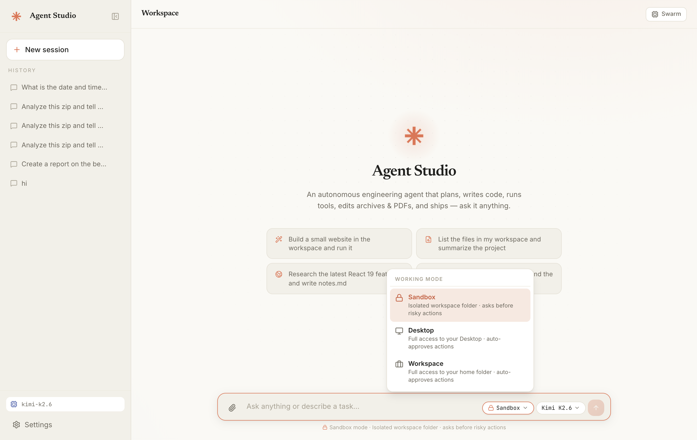

<div align="center">

# ✳️ Agent Studio

### Turn a **free NVIDIA NIM API key** into your own private, autonomous coding agent.

**One command to install. One command to run.** No accounts, no subscriptions, no cloud bills — it all runs on your own Mac or Windows PC. Watch it think, write code, run it, and even drive a **real Chrome browser** — live, inside an on-screen **Agent Computer**.

<br/>



<br/>


<br/>

### 💖 Support the Creator

Agent Studio is **free & open source**. If it helps you, **please support the creator** — it keeps the project alive and growing.

### 👉 [**❤️ Support Creator**](https://pages.razorpay.com/pl_T1zknR655GpRoS/view)

</div>

---

## ⚡ Install in one line

You only need **Python 3.10+** installed. Then paste **one command** into your terminal:

### 🍎 macOS / Linux — open **Terminal**:
```bash
curl -fsSL https://raw.githubusercontent.com/Ameenlogin/AgentStudio/main/install.sh | bash
```

### 🪟 Windows — open **PowerShell**:
```powershell
irm https://raw.githubusercontent.com/Ameenlogin/AgentStudio/main/install.ps1 | iex
```

That's it — no downloading, no unzipping, no clicking through folders. It installs everything and adds an **`agentstudio`** command. **Open a new terminal**, then anywhere:

```bash
agentstudio run        # ▶️  start Agent Studio (your browser opens automatically)
agentstudio update     # ⬆️  update to the latest version (pull + rebuild)
agentstudio stop       # ⏹️  stop it
agentstudio where      # 📁  show where it's installed
```

> Your browser opens to **http://127.0.0.1:8000** on its own. After the first setup, `agentstudio run` starts in seconds.
> The short **`agent`** command also works *if that name isn't already taken* on your machine.

### 🔄 Update to the latest version

Already installed? Pull the newest version with **one command**:

```bash
agentstudio update
```

This fetches the latest code from GitHub, reinstalls the backend, and **rebuilds the UI** so new features and speed-ups take effect right away. (Short alias: `agent update`; on Windows the command is identical.) Then start it again with `agentstudio run`.

### 🧭 All the ways to run it

| Command | What it does |
|---------|--------------|
| `agentstudio run` *(or `start`)* | Start the app + open the browser |
| `agentstudio install` *(or `update`)* | Update to the latest version |
| `agentstudio stop` | Stop a running instance (frees port 8000) |
| `agentstudio where` | Print the install folder |
| **Prefer not to use a terminal?** | Download the repo and **double-click** `START.command` (macOS) or `START.bat` (Windows) — or `install`/`run` for the two-step version |

---

## 🔑 Get your **free** NVIDIA API key (60 seconds)

Agent Studio runs on **NVIDIA NIM** — NVIDIA's free, hosted AI models. To get a key:

1. Go to **[build.nvidia.com](https://build.nvidia.com)** and **sign in** (free — Google or email).
2. Open any model (for example **Kimi K2**).
3. Click **“Get API Key”** and **copy** it (it starts with `nvapi-…`).
4. The first time you open Agent Studio, paste it into **Settings → API key**. Done. 🎉

No credit card. The free tier is plenty for everyday coding and research.

---

## 🧠 What is it, really?

Most “AI chats” just talk. **Agent Studio acts.** Give it a goal and it becomes a *thinking agent* that works like a real engineer:

> **Think → Pick a tool → Do it → Look at the result → Keep going → Stop when it's actually done.**

You watch the whole thing live — its reasoning, every file it touches, every command it runs — streamed into a clean timeline. It writes code, runs it, fixes its own bugs, searches the web, edits PDFs and zips, and hands you finished work.

It’s like having **Claude Code / Cursor-style superpowers**, but **local, free, and powered by your own NVIDIA key.**

---

## 🖥️ The Agent Computer

Watch the agent work inside a single, self-contained **mini-computer** right in the chat — a macOS-style desktop with **Terminal, Files, Editor, and a real Browser**. It opens when work begins, switches apps as the agent acts, and **auto-closes the moment the task is done** (one click to re-open).

<div align="center">

</div>

- **One box, not a wall of cards** — every command, file write, and browser click streams into the same window.
- **A real browser tab** — when the agent drives Chrome it shows the live page screenshot, the URL bar, and a scrubbable strip of each action (click, type, navigate) with live animations.
- **Live, honest output** — no fake skeletons; you see the actual terminal output, the actual code, the actual page.

---

## 🤖 Pick any of 6 top models

Switch models anytime from the composer — all served free through NVIDIA NIM:

<div align="center">

</div>

| Model | ID | Best at |
|-------|----|---------|
| **Kimi K2.6** *(default)* | `moonshotai/kimi-k2.6` | Agentic coding, tools, multimodal — 1T-param MoE |
| **GPT-OSS 120B** | `openai/gpt-oss-120b` | Deep coding & reasoning |
| **GPT-OSS 20B** | `openai/gpt-oss-20b` | Fast coding & tool use |
| **Llama 3.3 70B** | `meta/llama-3.3-70b-instruct` | Reliable general coding |
| **Nemotron Super 49B** | `nvidia/llama-3.3-nemotron-super-49b-v1.5` | Reasoning + tools |
| **Qwen3 Next 80B** | `qwen/qwen3-next-80b-a3b-instruct` | Coding & reasoning |

---

## 🛠️ What it can do

| You ask… | It does… |
|----------|----------|
| “Build a website / app / script” | Plans it, writes the files, runs it, fixes errors, hands you a working project |
| “Fix this huge codebase / WordPress plugin” | Pages through **large files**, greps to the exact spot, and **patches** precisely — even **inside a `.zip`** without unpacking |
| “Research X and write me notes” | Searches the web, reads pages, and writes the document |
| “Log in and do X on this site” | Drives a **real Chrome** browser — navigates, clicks, types, fills forms, scrolls, switches tabs, and reads the page; you can finish a login/2FA in a visible window and it keeps the session |
| “Turn this into a PDF / zip it up” | Creates PDFs from text/Markdown and packages downloadable archives |
| “Analyze this data / database” | Runs real Python (pandas, sqlite, …) and installs any library it needs |

**Built for big work.** It handles large files, large read/writes, big repos and databases by reaching for the right tool — paged reads, regex search, bulk multi-file edits, in-place archive editing — instead of choking on size. And it **knows** it has these tools, so it uses them.

---

## 🦺 Safe by design

You choose how much freedom it gets, right from the composer:

<div align="center">

</div>

- **Sandbox** — works in an isolated folder and **asks before** anything risky.
- **Desktop / Workspace** — broader access with auto-approve, for when you trust it.

Every file/command stays on **your machine**. Before writing or running anything in Sandbox mode, it pauses for **Allow once / Allow all / Deny**.

---

## ✨ Under the hood (the simple version)

- **Two speeds** — quick questions get an instant answer; real tasks trigger the full think-and-build loop.
- **Knows when to stop** — it won’t loop forever or re-print the same report; it finishes when the job is done.
- **Does things in bulk** — reads, writes, and patches many files at once instead of one-by-one.
- **Multi-agent mode** — for big tasks it splits into a planner, parallel researchers, a builder, and a synthesizer.
- **Remembers** — every conversation is saved locally (separate sessions) with integrity checks.
- **Never wastes your key** — repeat questions are answered from a local cache, and requests stay under NVIDIA’s rate limit automatically.

```
agentstudio run  ─►  local server (FastAPI, :8000)  ─►  your browser UI (React)
                     │
                     └─ streams the agent's thinking + tools live, talking to
                        your chosen NVIDIA NIM model with your free API key
```

**Stack:** FastAPI · SQLite · React 19 + Vite + Tailwind · OpenAI-compatible client → NVIDIA NIM.

---

## ✅ Requirements

- **macOS** or **Windows 10/11**
- [Python 3.10+](https://www.python.org/downloads/) *(Windows: tick “Add python.exe to PATH”)*
- A free **NVIDIA NIM API key** → [build.nvidia.com](https://build.nvidia.com)
- *(Node.js only if you build the UI from source — the installer handles it.)*
- *(First setup also downloads a private Chromium (~100 MB) for the agent’s real-browser tools — automatic, one time.)*

## 🩹 Troubleshooting

- **`agentstudio` not found** — open a **new** terminal after installing (or run `source ~/.zshrc`) so your PATH refreshes.
- **Browser didn’t open** — visit **http://127.0.0.1:8000** manually.
- **Agent’s browser won’t launch** — run `playwright install chromium` once inside `backend/` (with the venv active); the install scripts do this automatically.
- **“API key not configured”** — add your NVIDIA key in **Settings**.
- **Port 8000 busy** — `agentstudio run` frees it automatically.

---

<div align="center">

## 💖 Support the Creator

Agent Studio is **free & open source** and built with love. If it saves you time, **please support the creator** — every bit helps keep it alive and improving.

### 👉 [**❤️ Support Creator**](https://pages.razorpay.com/pl_T1zknR655GpRoS/view)

<br/>

<sub>

⭐ **Star this repo if it helped you!**

**Keywords:** free NVIDIA NIM API key · local AI coding agent · free Claude Code alternative · Kimi K2 · GPT-OSS · Llama 3.3 · Qwen3 · Nemotron · Moonshot AI · autonomous coding agent · self-hosted AI assistant · macOS & Windows AI agent · open source coding agent · build.nvidia.com

</sub>
</div>
